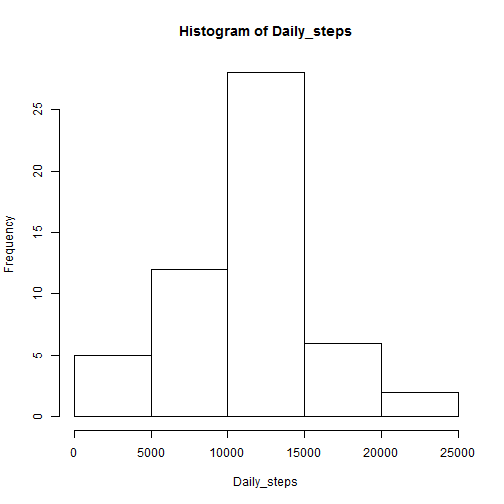
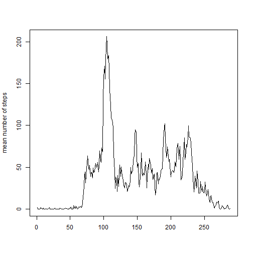
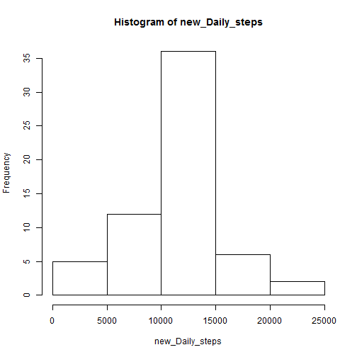
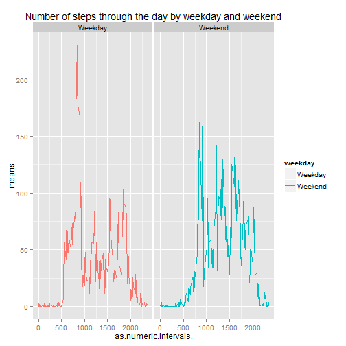

# Reproducible Research: Peer Assessment 1

## Loading and preprocessing the data

load the data and convert date to format Date:

```r
data = read.csv("activity/activity.csv")
data$datef = as.Date(as.character(data$date), "%Y-%m-%d")
```


## What is mean total number of steps taken per day?


```r
# create an index of the sum of steps per day:
Daily_steps = na.omit(sapply(split(data$steps, data$date), sum))
# the mean number of steps per day:
mean(Daily_steps)
```

```
## [1] 10766
```

```r
# the median number of steps per day:
median(Daily_steps)
```

```
## [1] 10765
```


## create a histogram of the total number of steps taken each day

```r
hist(Daily_steps)
```

 


## What is the average daily activity pattern?

Make a time series plot (i.e. type = "l") of the 5-minute interval (x-axis)
and the average number of steps taken, averaged across all days (y-axis)


```r
# get rid of NAs
datanona = na.omit(data)
# calculate mean steps by interval
timeseries = sapply(split(datanona$steps, datanona$interval), mean)
# make the plot!
plot(timeseries, type = "l", ylab = "mean number of steps", xlab = "")
```

 


Which 5-minute interval, on average across all the days in the dataset,
contains the maximum number of steps?


```r
# what is the maximum number of steps?
max = max(timeseries)
# what is the time associated with the maximum number of steps
b = 0
for (i in 1:length(timeseries)) {
    if (timeseries[i] == max) {
        b = timeseries[i]
    }
}
names(b)
```

```
## [1] "835"
```

```r

```


## Imputing missing values

1. Calculate and report the total number of missing values in the dataset
(i.e. the total number of rows with NAs)


```r
sum(is.na(data))
```

```
## [1] 2304
```


2. Devise a strategy for filling in all of the missing values in the dataset. The strategy does not need to be sophisticated. For example, you could use
the mean/median for that day, or the mean for that 5-minute interval, etc.


```r
# create a reference database with means for time intervals
intervals = names(timeseries)
means = as.numeric(timeseries)
reference = data.frame(intervals, means)
# replace NAs in steps with mean values
for (i in 1:nrow(data)) {
    if (is.na(data$steps[i])) {
        interval = data$interval[i]
        replace = reference$means[reference$intervals == interval]
        data$steps[i] = replace
    }
    
}
# check the loop worked:
sum(is.na(data$steps))  #answer should be 0
```

```
## [1] 0
```


3. Create a new dataset that is equal to the original dataset but with the
missing data filled in.


```r
newdata = data.frame(data$steps, data$datef, data$interval)
```


4. Make a histogram of the total number of steps taken each day and Calculate
and report the mean and median total number of steps taken per day. Do
these values differ from the estimates from the first part of the assignment?
What is the impact of imputing missing data on the estimates of the total
daily number of steps?


```r
# recreate an index of the sum of steps per day:

new_Daily_steps = sapply(split(newdata$data.steps, newdata$data.datef), sum)

hist(new_Daily_steps)
```

 

```r
# the mean number of steps per day:
mean(new_Daily_steps)
```

```
## [1] 10766
```

```r
## original means was: 10766

# the median number of steps per day:
median(new_Daily_steps)
```

```
## [1] 10766
```

Conclusion, there is little change in patterns or statistics by replacing NAs with appropriate means

## Are there differences in activity patterns between weekdays and weekends?

1. Create a new factor variable in the dataset with two levels - "weekday"
and "weekend" indicating whether a given date is a weekday or weekend
day.

```r
# quick recode of newdata names
colnames(newdata) = c("steps", "date", "interval")
# create a new column: days, with appropriate days of the week and a column
# that works out if that day is a weekday or weekend (Saturday / Sunday)
weekend = c("Saturday", "Sunday")
for (i in 1:nrow(newdata)) {
    newdata$days = weekdays(newdata$date[i])
    if (newdata$days[i] %in% weekend) {
        newdata$weekday[i] = "Weekend"
    } else {
        newdata$weekday[i] = "Weekday"
    }
}
newdata$weekday = as.factor(newdata$weekday)
```


2. Make a panel plot containing a time series plot (i.e. type = "l") of the
5-minute interval (x-axis) and the average number of steps taken, averaged
across all weekday days or weekend days (y-axis). 


```r
library(ggplot2)

# Sorry this is long and messy, but I couldn't think of a more parsimonious
# way to do this.
weekdays = subset(newdata, newdata$weekday == "Weekday")
weekends = subset(newdata, newdata$weekday == "Weekend")

timeseries1 = sapply(split(weekdays$steps, weekdays$interval), mean)
timeseries2 = sapply(split(weekends$steps, weekends$interval), mean)


intervals = c(names(timeseries1), names(timeseries2))
means = c(as.numeric(timeseries1), as.numeric(timeseries2))
weekday = c(rep("Weekday", length(timeseries1)), rep("Weekend", length(timeseries2)))
# figuring out that to build the new data frame I had to do assign intervals
# as.numeric took frikin hours. Anway - new dataframe for the charts:
reference = data.frame(as.numeric(intervals), means, weekday)

# and finally.... the chart
ggplot(data = reference, aes(x = as.numeric.intervals., y = means, group = weekday, 
    colour = weekday)) + geom_line() + labs(title = "Number of steps through the day by weekday and weekend") + 
    facet_grid(. ~ weekday)
```

 

```r

```

Thanks for your time, hope that was all clear enough - have a nice day :)
